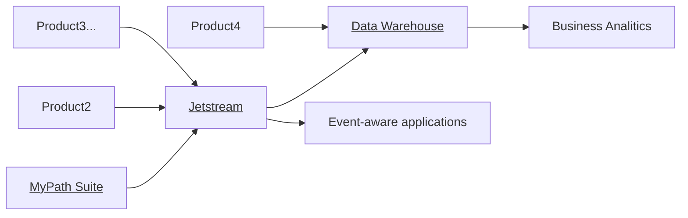

- 👋 Hi, I’m Carlos Quesada (@carlos-edgenuity)
- 👀 I’m interested in making computers work for humans, and all things related to the HCI and personalization.
- 🌱 I’m currently managing the teams that develop and maintain the event bus and data warehouse.
- 💞️ I’m looking to collaborate on business intellignece and generative AI projects.
- 📫 How to reach me on Slack `@Carlos Quesada`

I love UML diagrams! 

https://github.blog/2022-02-14-include-diagrams-markdown-files-mermaid/
https://mermaid.js.org/syntax/flowchart.html

<!---
carlos-edgenuity/carlos-edgenuity is a ✨ special ✨ repository because its `README.md` (this file) appears on your GitHub profile.
You can click the Preview link to take a look at your changes.
--->
